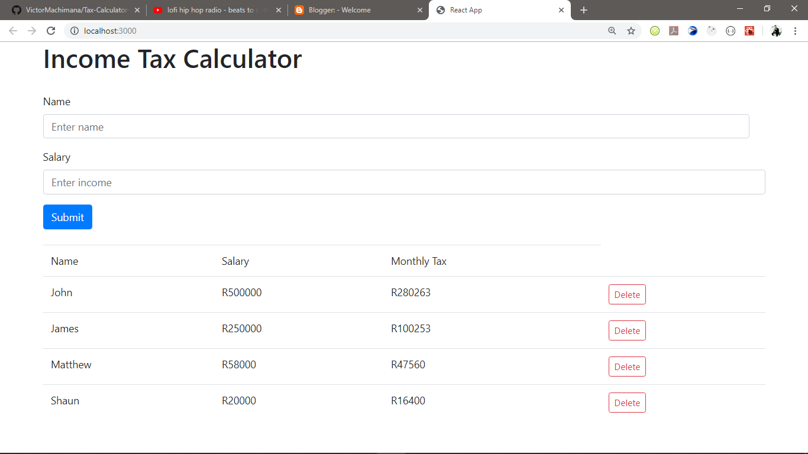

# Tax-Calculator-Full-stack
Tax Calculator using react js, node js and express

#go to the tax salary folder on your terminal and
type npm install then cd to income to install node_module as well,
then npm on both directories to start to start the app

<b>Tax Calculator</b>

